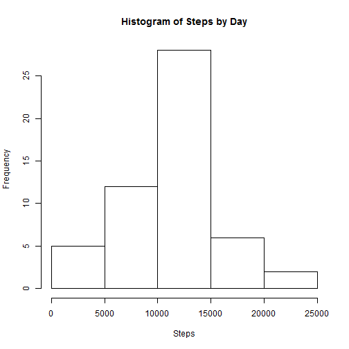
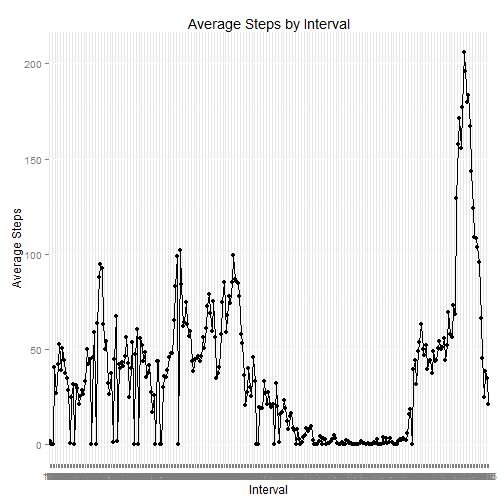
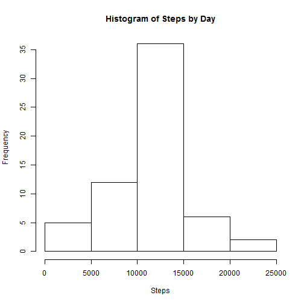
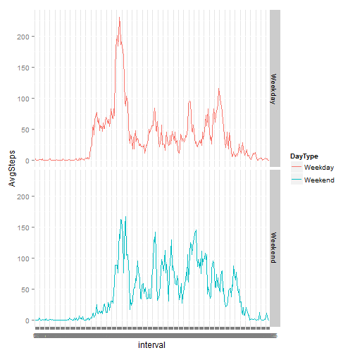

This study analyzes personal activity data derived from subjects wearing monitoring devices such as Fitbit, Nike Fuelband, or Jawbone Up. The study attempts to answer the following questions:

1. What is mean total number of steps taken per day?
2. What is the average daily activity pattern?  
3. Are there differences in activity patterns between weekdays and weekends?

###Processing the Data

First, we load the sample data set that we'll be utilizing for this study. The study is based on a device that collected data through out the day during the months of October and November of 2012. The data includes the number of steps taken in 5 minute intervals each day.


```r
#load libraries

library(plyr)
library(dplyr)
library(ggplot2)
library(Hmisc)

raw <- read.csv("./sourcedata/activity.csv")
```

Next, we process the data so that it is ready for per-day analysis, which will be the first objective.


```r
#calculate number of steps taken per day. first, group by day; then, summarize steps. 

tsteps <- tapply(raw$steps,raw$date,sum)
tsteps <- as.data.frame(tsteps)
tsteps <- mutate(tsteps,date=row.names(tsteps))
tsteps <- tsteps[,c(2,1)]
```

###What is mean total number of steps taken per day?

The mean number of steps per day is 10,766.19. The median number of steps per day is 10,765. Below is the code used after the data had been processed in the previous steps. 


```r
#calculate mean and median of steps by day

complete <- na.omit(tsteps)
meansteps <- mean(complete$tsteps)
mediansteps <- median(complete$tsteps)
```


The chart below is a histogram that helps give a visual idea of the mean/median steps per day.   

 

###What is the average daily activity pattern?

The chart below (generated by the code above it) shows the average daily activity pattern, illustrating the average step count for each 5 minute interval. We can see that XXXXXX is the 5 minute interval that generates the most steps. 


```r
raw$interval <- as.factor(raw$interval)
clean <- na.omit(raw)

cleaninterval <- tapply(clean$steps,clean$interval,mean)
cleaninterval <- as.data.frame(cleaninterval)
cleaninterval <- mutate(cleaninterval,interval=row.names(cleaninterval))
cleaninterval <- cleaninterval[,c(2,1)]
names(cleaninterval) <- c("interval","AvgSteps")
ggplot(data=cleaninterval, aes(x=interval, y=AvgSteps, group=1)) + geom_line() + geom_point() +
  xlab("Interval") + ylab("Average Steps") +
  ggtitle("Average Steps by Interval")
```

 

Utilizing the code below, we can see that the 8:35 interval is one that generates the most average steps. 


```r
cleaninterval$AvgSteps <- as.numeric(cleaninterval$AvgSteps)
maxinterval <- filter(cleaninterval, AvgSteps==max(AvgSteps))
```

###Imputing Missing Values

The data set contained many "NA" values that may limit or distort our analysis. To compensate for this issue, we filled each "NA" value with the average value for that interval. Below is the code that illustrates how a new data set with imputed values for NA's was generated.


```r
#Calculate and report the total number of missing values in the dataset (i.e. the total number of rows with NAs)

missingrows <- nrow(raw) - nrow(clean)

#replace NAs with the mean steps of that intervals

rawfill <- ddply(raw, "interval", mutate, imputed.value = impute(steps, mean))
```

With imputed values filled, we then re-calculated the totals for steps per day. Below is the code for our calculation.


```r
rawfill$imputed.value <- as.numeric(rawfill$imputed.value)
imputedset <- rawfill %>% group_by(date) %>% summarise(sum(imputed.value))
names(imputedset) <-c("date","steps")

hist(imputedset$steps,xlab="Steps",main="Histogram of Steps by Day")
```

 

We then re-calculated the mean and median daily step counts using the data set that contained imputed values in place of NA's. The mean and median both equalled 10,766.19 steps. As we can see, in comparison to the data set that coes not contain imputed values, the mean value did not change at all, while the median increased very slightly so that it equalled the mean. Below is the code that we used to determine this; we can see that is virtually identical to the code used to calculate the mean and median values for the initial data set, with the only difference being that it is now applied to the imputed data set. 


```r
meanimputed <- mean(imputedset$steps)
medianimputed <- median(imputedset$steps)
```

###Are There Differences in Activity Patterns Between Weekdays and Weekends?

To evaluate the differences in activity patterns between weekdays and weekends, we modify our data set with imputed values by adding a column called "Day Type" that specifies whether it is a Weekday or Weekend. Below is the code we used.  


```r
#Create a new factor variable in the dataset with two levels - "weekday" and "weekend" indicating 
#whether a given date is a weekday or weekend day.

rawfill$date <- as.Date(rawfill$date)

rawadded <- mutate(rawfill,DayType =ifelse(weekdays(rawfill$date) %in% c("Sunday","Saturday"), "Weekend","Weekday")) 

rawadded$imputed.value <- as.numeric(rawadded$imputed.value)
stepsintervaltype <- rawadded %>% group_by(interval,DayType) %>% summarise(mean(imputed.value))
names(stepsintervaltype) <- c("interval","DayType","AvgSteps")
stepsintervaltype$AvgSteps <- round(stepsintervaltype$AvgSteps,digits=2)
```

The differences between daily activity on Weekdays vs Weekends are illustrated in the chart below. 

 

